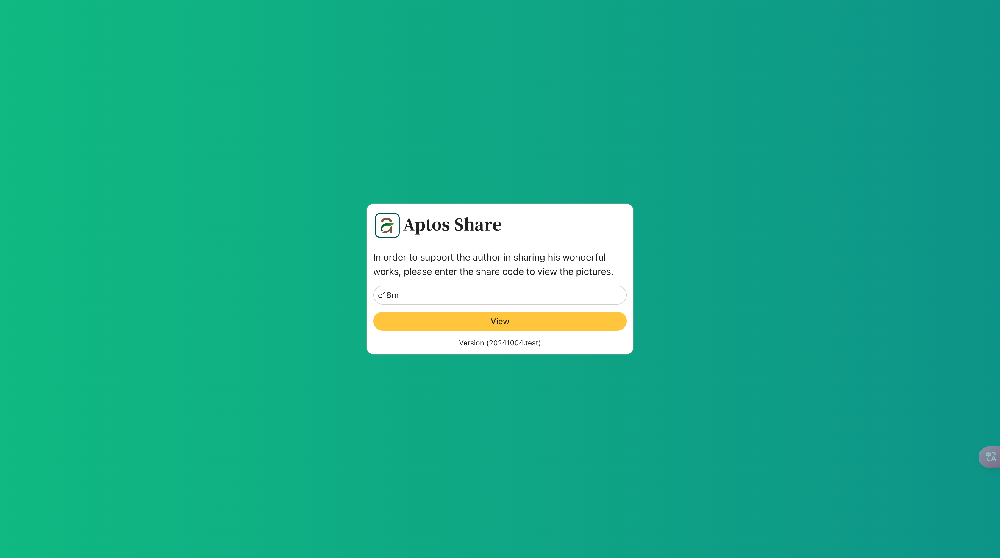

# Aptos Share

Aptos Share is a file sharing Dapp developed based on the Aptos contract. 

It publishes file sharing information through contracts. It provides decentralized storage and data availability through the Walrus protocol.

Aptos Share app can not only provide Walrus-based distributed storage, but also verify the sharing permissions of files.

This ensures that the original file owner can gain benefits from file sharing.

We implemented the native token transfer from Sui to Aptos using the Wormhole protocol.

Although the Aptos Share application is deployed on the Aptos blockchain, we use the characteristics of Wormhole to connect Aptos and Sui.

Sui users can use the Wormhole protocol to transfer native tokens to Aptos.

After the smart contract deployed on Aptos detects the native tokens transferred by Sui users, it can provide services to Sui users.

[Demo Web Site](https://4mxkzizfxcdbtz6vghb6usaqr9sxedv9uxxnevpzz6c997y67.walrus.site)

## Login with wallet

You need to use a wallet to log in to the system. Please select the wallet application you usually use.

This is the interface used by the file manager.

* The middle part is your file list, and all the files you share are displayed here.
* The button in the upper right corner can switch wallets or exit wallets.
* The button in the upper left corner is used to upload files. (When using it for the first time, you need to click the [Init contract] button to initialize the Aptos contract)

## Upload file

Aptos Share uses javascript running within your web browser to encrypt and decrypt files client-side, in-browser.

This Dapp makes no network connections during this process, to ensure that your keys never leave the web browser during
the process.

All client-side cryptography is implemented using the Web Crypto API. Files are encrypted using AES-CBC 256-bit symmetric encryption. The encryption key is derived from the password and a random salt using PBKDF2 derivation with 10000 iterations of SHA256 hashing.

The encrypted files are stored on the Walrus protocol, a decentralized storage and data availability protocol designed for large binary files, or “blobs.”

## Share files

Aptos Share Dapp provides three ways to share files

* free
* verification code
* paid

## 0x01 Share using free methods

First you need to choose to share files using the Free mode and publish the contract to Aptos. 

Then you can send the created URL to the user.

When the user visits the URL you provided, they can view the pictures you shared for free.

## 0x02 Use verification code

First you need to choose to share files using the code mode and publish the contract to Aptos.

Then you can send the created URL to the user.

When the user visits the URL you provided, they will need to enter the verification code you provided to view the pictures you shared.

## 0x03 Share using paid Aptos coin

First you need to choose to share files using the Pay mode and publish the contract to Aptos.

Then you can send the created URL to the user.

When the user visits the URL you provided, the user needs to connect to his wallet and pay Aptos coins according to the fee you set.

After the payment is successful, he can view the pictures you shared.

[Demo Web Site](https://4mxkzizfxcdbtz6vghb6usaqr9sxedv9uxxnevpzz6c997y67.walrus.site)

Email: bc443995@gmail.com

Donate to Sui Wallet Address: 0x6f25929f026483a440f5f16e03661087eb41604528050b989f48624b049c4b78
